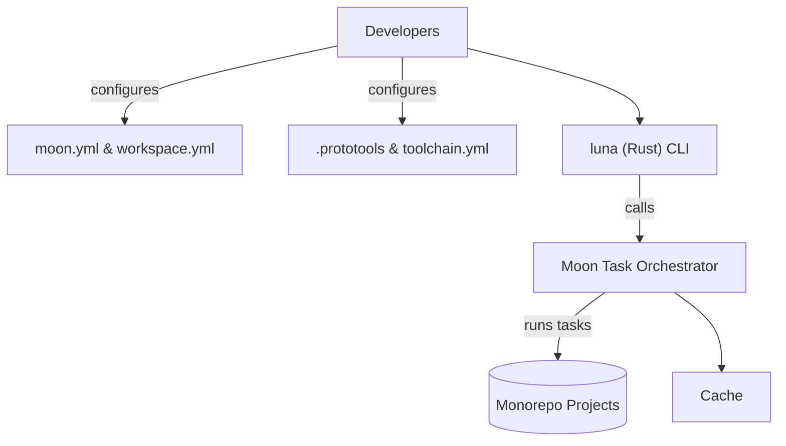

# Luna CLI Refactor Requirements Document

## Executive Summary

Luna’s current CLI is a Bun/TypeScript-based orchestrator for the monorepo. The goal is to replace it with a lower-level, Rust-based CLI integrated with [Moon](https://moonrepo.dev) and [Proto](https://moonrepo.dev/docs/proto) for orchestration, task management, and toolchain pinning. Moon already provides a rich task graph, caching, workspace/project management, and toolchain integration. Proto (via `.prototools`) can pin Node, Bun, Rust, etc. Versions per-directory. Starbase is a Rust CLI framework by the Moon team. We must evaluate using Starbase vs rolling our own Rust CLI with libraries like Clap.

This document lays out goals, functional and non-functional requirements, migration strategy, and implementation options. We strongly favor using Moon’s native features (task graph, pipelines, `dependsOn`, `inputs/outputs`, caching, affected detection) instead of custom orchestrators. Starbase offers a ready-made CLI structure but brings complexity; custom Rust crates (e.g. using Clap) are leaner but require more work. The requirements below capture the intended capabilities, success criteria, and risks. Concrete recommendations and examples are provided to guide the RFC rewrite and implementation.

## Goals and Non-Goals

**Goals:**

- **Monorepo Management via Moon:** Use Moon for all project/task orchestration. Define projects in `.moon/workspace.yml` (or equivalent), and tasks in `moon.yml`. Leverage Moon pipelines and “affected” filtering.
- **Rust-based CLI:** Implement a new CLI (e.g. `luna`) in Rust for core developer UX (commands like `luna build`, `luna dev`, etc.). Consider using [Starbase](https://github.com/moonrepo/starbase) to speed CLI development.
- **Remove Bun Root:** Eliminate Bun as a root dependency. Use Proto to manage Bun/Node/Pnpm (or npm/yarn) versions as needed.
- **Toolchain Pinning:** Ensure development and CI use pinned versions (via `.moon/toolchain.yml` and `.prototools`) for reproducibility. All tools (Node, Bun, pnpm, Rust, etc.) should be managed by Proto.
- **Seamless Orchestration:** Rely on Moon’s built-in orchestration (task graph, concurrency, caching). Any DAG or task scheduling in the CLI should reuse Moon’s facilities, not reimplement them.
- **Plugin/Extension Model:** Allow extensions or “commands” to be added in the future (e.g. developer-defined tasks or plugins). Ideally integrate with Moon’s pipeline and Proto’s plugin support, or use Starbase’s command grouping.
- **Improved DX:** Faster bootstrapping (zero local state to clone/install), clear UX (help text, consistent logging), robust error handling, minimal cognitive overhead.
- **Hermetic CI:** Use Proto to pin tool versions in CI. Leverage Moon’s remote caching for stable CI cache hits.
- **Incremental Migration:** Transition gradually without blocking current workflows. Maintain existing TS CLI compatibility long enough to validate.

**Non-Goals:**

- **Replacing Package Managers:** This refactor is not about changing package managers (we still use pnpm/npm/yarn via proto).
- **Overhauling Projects:** It is not a project structure overhaul. We do not consolidate or rename projects beyond configuration tweaks.
- **Non-Web Tools:** No need to adopt languages/tools outside current scope (we’ll focus on Node/Bun/TS/JS tooling, Rust, Python if used, etc.).
- **Custom Orchestration:** Avoid building a custom dependency solver or workflow engine – use Moon for that.
- **Major Feature Changes:** The CLI should replicate existing functionality (build, test, etc.) without adding unrelated new features.

## Functional Requirements

1. **Task Orchestration:**
   - Define all CI/developer tasks in Moon (in `moon.yml`). Tasks should declare their `command`, `outputs`, `inputs`, and `dependsOn` projects. Moon’s pipelines will handle parallelism and ordering.
   - The CLI (Rust) should simply invoke these tasks (e.g. `moon run build`, `moon run lint`, etc.) or use Moon’s API to run them programmatically. The CLI itself should not contain task logic beyond delegating to Moon.
   - Support task groups like `build`, `test`, `lint`, `deploy` that run across multiple projects. Use Moon’s glob syntax (e.g. `moon run build:apps/*` or in config `tasks.build.args = ["apps/*"]`).
   - Expose an “affected” mode (run tasks only for changed projects) using Moon’s `--affected` or `--filter="affected"` flags. E.g. `luna build --affected`.
   - Provide a way to list tasks or show the dependency graph. Moon has `moon tasks` and `moon task-graph`. The CLI might wrap these (e.g. `luna tasks`, `luna graph`).

2. **Workspace & Project Resolution:**
   - Use a Moon workspace config (e.g. `.moon/workspace.yml`) to declare project roots and types. For example:

     ```yaml
     projects:
       web:
         root: apps/web
         type: application
       api:
         root: apps/api
         type: application
       ds:
         root: packages/ds
         type: library
     ```

   - Avoid manual scanning code. Moon can auto-discover projects via globs, or use explicit mapping for clarity. Projects should be categorized (`application`, `library`, or `tool`).
   - The CLI should honor project boundaries: running `luna build web` should only build the web app (invoking Moon filtered to that project).

3. **Affected Detection:**
   - Rely on Moon’s built-in “affected” logic. It uses git to determine changed files and knows project inputs via `inputs`. The CLI interface should allow e.g. `luna run build --affected`.
   - Ensure all tasks declare correct `inputs` and `outputs` so Moon can infer changes. Avoid writing a separate git diff walker.

4. **Caching:**
   - Enable Moon’s task-level caching. Each task must list its `outputs` to allow Moon to cache results (e.g. build artifacts, dist folders).
   - Configure remote caching (e.g. S3, GCS) so CI and developers share cached results. Moon supports remote stores out of the box.
   - Avoid re-running unnecessary work: tasks that haven’t changed inputs or dependencies should be skipped via Moon cache/hashes.

5. **Toolchain Pinning:**
   - Use `.moon/toolchain.yml` to pin supported languages (Node, Rust, Python, etc.) for Moon. Example:

     ```yaml
     toolchain:
       node: 18.2.1
       pnpm: 8.5.0
       python: 3.11.4
       bun: 1.2.0
     ```

   - Use `.prototools` (YAML) to pin additional tools/versions, especially for things Moon doesn’t handle out-of-box. Example:

     ```yaml
     # .prototools
     tools:
       proto: 0.19.0
       bun: 1.2.0
       node: 18.2.1
       pnpm: 8.5.0
       python: 3.11.4
     ```

   - Ensure `rust` toolchain is pinned by `rust-toolchain.toml` or via Proto (for cargo tasks).
   - The CLI must run under Proto’s context. Developers bootstrap by running `proto ensure` or a provided bootstrap script, and then use the CLI.

6. **Bootstrap & Installation:**
   - New developers should only need to install Proto once (e.g. via script) and then run a single command (like `luna bootstrap` or `proto run init`) to set up everything (install Node, Bun, etc. per .prototools).
   - The build/test tasks themselves should install dependencies via Node package managers (pnpm) as needed. If pnpm is not default, configure Proto to include pnpm.
   - Provide a script or command `luna setup` (or reuse `moon sync`/`moon hydrate`) that prepares the environment.

7. **CLI Commands and UX:**
   - The CLI should mirror common workflows. Example subcommands: `luna build`, `luna dev`, `luna test`, `luna lint`, `luna graph`, `luna tasks`, `luna version` (for the CLI itself).
   - Each command should map to Moon tasks or combinations thereof. E.g. `luna build` might invoke `moon run build:apps/*`. `luna dev` could start dev servers (or delegate to an existing script in one project).
   - Provide rich help text (e.g. `luna --help`). Starbase provides a help framework out of the box; if custom, use Clap’s help builder.
   - Use consistent logging/formatting. For example, Starbase uses semantic color and emoji (if using starbase)【66†L0-L3】. If custom, ensure clear prefixes (like `[luna]`).
   - Commands should exit with proper codes (0 success, non-zero on error).

8. **Plugin/Extension Model:**
   - Allow new commands or extensions to be added without modifying core code. For example, Starbase has a plugin/extension system (WASM plugins). If using Starbase, we can leverage its plugin crate support.
   - If custom, design the CLI to load modules (e.g. via dynamic libs or scanning a `commands/` folder) or encourage forking. At minimum, plan for extension commands (like `luna plugin add foo`).

9. **Logging, Telemetry, & Error Handling:**
   - Use structured logging if possible. For Rust, crates like `tracing` or Starbase’s logger can be used.
   - Provide verbose/quiet modes.
   - Errors should give actionable messages. If Moon fails, bubble up its error.
   - (Optional) telemetry: we may choose to log command usage stats (e.g. via `-v` logs) for improvement.

10. **Testing Strategy:**
    - Unit tests for CLI parsing (especially if using Clap/StructOpt).
    - Integration tests invoking the CLI on a dummy workspace (possibly using a tool like `assert_cmd`).
    - Smoke tests in CI: e.g. `luna tasks`, `luna version` must work.
    - End-to-end: run a sample build/test in CI with full cache enabled to verify no regressions.

## Non-Functional Requirements

- **Performance:** The Rust CLI should be fast at runtime (sub-second startup if possible). Moon’s task execution will parallelize where possible. Overall build/test times should not regress significantly.
- **Cross-Platform:** Support Linux, macOS, and Windows (Rust naturally compiles for all; Moon and Proto are cross-platform). Avoid OS-specific scripts or dependencies.
- **Hermeticity:** No global dependencies aside from the pinned toolchains. The CLI & tasks should not depend on any local global installs. Proto + Moon manage all tool installations in user space.
- **Reproducibility:** Builds must be reproducible given the same code. Pin all versions. Use lockfiles (package-lock.json, pnpm-lock.yaml, etc.) and ensure Moon tasks use them consistently.
- **Security:** Use vetted libraries (Moon, Proto, Starbase). Keep dependencies minimal. Review any plugin or external command usage to avoid injection.
- **Maintainability:** Keep configuration declarative (Moon/Proto). The Rust code should be modular (e.g. one module per command). Document the CLI code and config. Leverage well-maintained libraries (Starbase, Clap, anyhow, etc.).
- **Binary Size & Distribution:** If using Starbase (which pulls in async, etc.), the binary may be several MB. Acceptable for CLI tool. Distribute via a simple install (Cargo release, or a small script to compile).
- **Logging:** Allow logs to be toggled or redirected. The CLI should not flood screen by default.
- **Configuration:** Keep config files (moon.yml, .prototools) in repo root. Use environment variables sparingly (prefer config keys in `.moon/` or `.prototools`).

## Migration Strategy

- **Phase 1: Setup and Moon Integration**
  - Add `.moon/workspace.yml` and `moon.yml` with tasks that mirror current scripts. For example, if currently `bun run build`, make a Moon task:

    ```yaml
    tasks:
      build:
        description: Build all projects
        pipeline: # maybe a pipeline to run tasks in series
        strategy: parallel
        inputs: ["**/*"]
        outputs: ["dist/**"]
        runner: "bash"
        command: pnpm run build
    ```

  - Add `.prototools` and `.moon/toolchain.yml` with pinned versions. Ensure CI uses `proto` to install the correct Node/Bun.
  - Validate `moon run build` and others work alongside existing CLI. Developers should still be able to use Bun CLI while testing Moon tasks in parallel.

- **Phase 2: Develop Rust CLI (Starbase)**
  - Scaffold the new `luna` CLI project (crate). If using Starbase, bootstrap with its starter template. If custom, initialize with Clap.
  - Implement basic commands: e.g. `luna tasks` (runs `moon tasks`), `luna graph` (`moon task-graph`), `luna build`, `luna test`, etc. These commands invoke Moon (shell out to `moon`) or use Moon’s internal libraries if available.
  - Write help text and ensure `luna --help` lists commands.
  - Build the CLI for all platforms and add to repo (or provide a path).

- **Phase 3: Parallel Testing & CI Migration**
  - Update CI pipelines to try `luna build` (or directly `moon run build`) in addition to existing scripts. Enable Moon’s cache in CI.
  - Add integration tests for `luna` commands if possible.
  - Once stable, make `luna` the primary CLI in CI scripts (replace `bun ...`). CI should fail if `luna` or Moon tasks fail, alerting any missing tasks.

- **Phase 4: Deprecate Bun CLI and Clean-up**
  - Remove or archive the old Bun-based CLI code (keep for fallback if needed, but mark deprecated).
  - Update documentation to reference `luna` instead of Bun CLI.
  - Finalize toolchain (maybe remove Bun from proto if no other use).

- **Rollback Plan:** If major issues occur, revert CI changes to use the Bun CLI again. Keep the old CLI code around until new CLI is fully proven. Run both CLIs in parallel for a few days for sanity checks.

## Implementation Options (Analysis)

| Option                        | Description                                                                                | Pros                                                                                                                                                                                   | Cons                                                                                                                                                              |
| ----------------------------- | ------------------------------------------------------------------------------------------ | -------------------------------------------------------------------------------------------------------------------------------------------------------------------------------------- | ----------------------------------------------------------------------------------------------------------------------------------------------------------------- |
| **Starbase-based CLI (Rust)** | Use Starbase framework to build `luna` CLI in Rust with command groups and plugin support. | • Official from Moon team, likely well-maintained.<br>• Provides structured CLI (commands, session) and utilities (async, logging, version).<br>• Consistent UX with other Moon tools. | • Additional dependency (learning Starbase).<br>• Larger binary (includes WASM plugin support, async, etc.).<br>• Possibly overkill if CLI is simple.             |
| **Custom Rust CLI (Clap)**    | Hand-roll CLI using Clap or similar crates, minimal dependencies.                          | • Leaner binary and code.<br>• Full control over architecture.<br>• No need to learn Starbase specifics.                                                                               | • Must implement help text, subcommand parsing manually (though Clap simplifies).<br>• Less built-in support for tasks or plugins.<br>• Reinventing CLI patterns. |
| **Hybrid Approach**           | Use Clap or Starbase-utils libs for core, and Starbase packages for styling or plugins.    | • Balanced: use only needed Starbase pieces (e.g. `starbase_utils` for output styling).<br>• Avoid full Starbase complexity.                                                           | • Mix-and-match may be confusing.<br>• Partial integration might still need custom glue.                                                                          |

**Recommended Choice:** Start with **Starbase** for the CLI. It aligns with Moon team’s ecosystem (Starbase commands are async by default, have nice output styling, and built-in version management). It also potentially allows us to use Moon’s WASM plugin mechanism later. The initial learning curve is acceptable given long-term benefit. If the CLI proves very simple and Starbase adds too much overhead, we could switch to Clap-only with minimal refactoring.

## Feature Comparison Table

| Feature                       | Moon/Proto                                   | Starbase CLI                                                            | Custom Rust CLI               |
| ----------------------------- | -------------------------------------------- | ----------------------------------------------------------------------- | ----------------------------- |
| **Task Orchestration**        | Built-in (`moon run`, pipelines)【22†L0-L7】 | CLI triggers Moon (no own graph)                                        | CLI triggers Moon similarly   |
| **Task Graph / Dependencies** | Native (dependsOn, priority)                 | -                                                                       | -                             |
| **Affected Detection**        | Supported (`--affected` flag)                | Must call Moon or reimplement                                           | Must call Moon or reimplement |
| **Caching**                   | Native (local + remote)                      | -                                                                       | -                             |
| **Version/Toolchain Pinning** | Proto & `.moon/toolchain.yml`                | - (just calls pinned environment)                                       | -                             |
| **CLI Structure**             | n/a                                          | Command groups, async/await                                             | Subcommands (via Clap)        |
| **Help & UX**                 | Moon has built-in CLI (`moon help`)          | Automated help from Starbase                                            | Clap-derived help             |
| **Plugin System**             | Proto plugins, WASM (for tasks)              | Starbase plugins (WASM)                                                 | None (unless custom designed) |
| **Logging & Output**          | Moon outputs tasks info, color usage         | Starbase includes [`starbase_styles`] for consistent output【66†L0-L3】 | Custom formatting             |
| **Performance**               | Rust-based engine; fast                      | CLI startup ~200ms+ (Rust)                                              | CLI startup similar           |
| **Binary Size**               | n/a                                          | Larger (~10+ MB)                                                        | Smaller (< 5 MB)              |
| **Cross-Platform**            | Yes                                          | Yes                                                                     | Yes                           |

_Note:_ Moon itself is a Rust binary, so most heavy-lifting is in Moon/Proto. The CLI just orchestrates or wraps Moon calls.

## Risk Analysis

| Risk                                        | Likelihood | Impact | Mitigation                                                                                                    |
| ------------------------------------------- | ---------- | ------ | ------------------------------------------------------------------------------------------------------------- |
| **Custom Orchestration Redundant**          | Medium     | High   | Avoid writing custom graph runners. Use Moon tasks/pipelines. Document and train team on Moon.                |
| **CI Cache Breakage**                       | Medium     | Medium | Validate cache keys before cutover. Keep old build logic to compare. Use Moon remote cache.                   |
| **Developer Friction**                      | High       | Medium | Provide clear docs and training on new CLI. Maintain aliases (e.g. `luna` vs old commands) during transition. |
| **Moon/Proto Version Drift**                | Low        | Medium | Pin versions in `.prototools`. Lock CI images. Regularly update all tools together.                           |
| **Starbase Maturity / Bugs**                | Low        | Low    | Starbase is stable (150k+ downloads【26†L5-L7】). Use latest release. Have fallback CLI or script if needed.  |
| **Performance Regression**                  | Low        | Medium | Benchmark existing vs new (especially cold starts). Optimize Rust code or parallelism as needed.              |
| **Broken Workflows (build/test)**           | Medium     | High   | Comprehensive integration tests. Stagger rollout, preserve old CLI until parity.                              |
| **Environmental Differences (Win vs Unix)** | Medium     | Low    | Test on all platforms. Avoid shell-specific features (use cross-platform crates or shims).                    |
| **Plugin Complexity**                       | Low        | Low    | Start with core functionality; only add plugins if needed. Design plugin API early if needed.                 |
| **Security Issues in New Code**             | Low        | Low    | Code review, dependabot for Rust deps, static analysis. Use Rust’s safety and avoid eval.                     |

## Acceptance Criteria

- **Functional Parity:** All existing Luna CLI commands (build, dev, test, lint, etc.) are reproducible via Moon tasks and the new CLI. No functionality is lost.
- **Moon-first Execution:** Tasks should be executed by Moon under the hood, utilizing caching. Manual task execution is minimized.
- **Stable CI:** CI pipelines should pass using the new config (e.g. `luna build`, `luna test`), with equal or improved cache hit rates.
- **Reproducible Environments:** After running the bootstrap/setup, developers on any machine (macOS/Linux/Windows) can perform builds/tests with the same results.
- **Zero Downtime Migration:** We can merge changes without breaking trunk (the old CLI remains functional until cutover).
- **Usability:** The new CLI has clear help, proper exit codes, and logs. A dev-run books show success (e.g. sample run output).
- **Documentation:** Update docs to reflect new commands and removal of Bun. Provide a migration guide for devs.

## RFC Rewrite Suggestions

Below are examples of how RFC sections can be rewritten to align with Moon/Proto best practices. These are illustrative; adapt to actual RFC text.

- **Original (Example Task Graph Section):**

  > _The CLI will walk each project’s filesystem, building a manual graph of dependencies, then execute tasks in topological order._  
  > **Rewrite:**  
  > _Leverage Moon’s built-in task graph. Define each project’s tasks in `moon.yml` with `dependsOn` relationships. Moon will automatically compute the execution order and parallelism, eliminating the need for custom graph code. For example:_
  >
  > ```yaml
  > tasks:
  >   test:
  >     dependsOn: [build]
  >     command: pnpm run test
  >     inputs: ["src/**", "package.json"]
  >     outputs: ["coverage/**"]
  > ```

- **Original (Orchestration):**

  > _A custom DAG-based orchestrator will invoke underlying tool commands (like `bun run`). The CLI will spawn child processes and manage concurrency._  
  > **Rewrite:**  
  > _Use Moon pipelines instead. Moon can run tasks across projects in parallel, respecting `dependsOn` and caching. The Rust CLI simply calls `moon run <task>` or uses Moon’s Rust API. This avoids reinventing orchestration logic._

- **Original (Workspace Resolution):**

  > _The CLI will search up directories to find the monorepo root and discover sub-projects via custom code._  
  > **Rewrite:**  
  > _Define projects explicitly in `.moon/workspace.yml` using globs or explicit paths. Moon handles workspace root detection and project listing. Example:_
  >
  > ```yaml
  > projects:
  >   web:
  >     root: apps/web
  >   api:
  >     root: apps/api
  >   frontend:
  >     glob: "apps/*"
  > ```

- **Original (Toolchain/Pinning):**

  > _We will keep a Bun installation at the repo root. Node versions will be managed via `.nvmrc` or similar._  
  > **Rewrite:**  
  > _Remove global Bun. Instead, use Proto’s `.prototools` and Moon’s toolchain configs to pin versions. For example,_
  >
  > ```yaml
  > # .prototools
  > tools:
  >   node: 18.2.1
  >   bun: 1.2.0
  >   python: 3.11.4
  > ```
  >
  > _This ensures reproducible builds. Moon auto-installs Node/Bun as needed._

- **Original (CLI Commands):**
  > _We'll implement commands like `cli build --project web` manually._  
  > **Rewrite:**  
  > _CLI commands map directly to Moon tasks or `moon run`. For example, `luna build web` runs the `build` task for the `web` project (internally `moon run build:web`). Use Starbase (or Clap) to define subcommands. This provides concise UX (e.g. `luna build`, `luna test --affected`)._

These examples illustrate turning ad-hoc logic into declarative Moon configs and standardized CLI definitions. The final RFC text should similarly emphasize using Moon/Proto features and removing bespoke scripting.

## Example Config Snippets

```yaml
# .moon/toolchain.yml
toolchain:
  node: 18.2.1
  pnpm: 8.5.0
  python: 3.11.4
  rust: 1.71.0
  bun: 1.2.0

# .prototools
tools:
  proto: 0.19.0
  node: 18.2.1
  bun: 1.2.0
  pnpm: 8.5.0
  python: 3.11.4

# .moon/workspace.yml
projects:
  web:
    root: apps/web
    type: application
  api:
    root: apps/api
    type: application
  ui-lib:
    root: packages/ui
    type: library

# moon.yml (in repo root)
tasks:
  build:
    description: Build all applications
    pipeline:
      tasks:
        - build:frontend
        - build:backend
  build:frontend:
    workspace: web
    command: pnpm run build
    inputs: ["apps/web/src/**", "apps/web/package.json"]
    outputs: ["apps/web/dist/**"]
  build:backend:
    workspace: api
    command: pnpm run build
    inputs: ["apps/api/src/**", "apps/api/package.json"]
    outputs: ["apps/api/dist/**"]
```

```rust
// Example Starbase-based CLI (pseudocode, using Clap/Starbase)
use starbase_common::model::{CommandGroup, Flag, SubCommand};
use starbase_core::Session;
use std::error::Error;

// Define commands using Clap-like macros (if Starbase has similar attributes)
#[derive(CommandGroup, Debug)]
#[group(name = "Luna", version = "0.1.0", about = "Luna CLI (Rust)") ]
struct CLI {
    #[subcommand]
    command: LunaCommand,
}

#[derive(SubCommand, Debug)]
enum LunaCommand {
    Build { project: Option<String>, #[flag(short, long)] affected: bool },
    Test { project: Option<String> },
    Lint,
    Graph,
    Tasks,
}

fn main() -> Result<(), Box<dyn Error>> {
    let cli = CLI::parse(); // Clap/Starbase integration
    let mut session = Session::new("luna");
    // Here, dispatch to Moon or custom logic based on cli.command
    match cli.command {
        LunaCommand::Build { project, affected } => {
            let mut cmd = session.command("moon");
            if let Some(proj) = project {
                cmd = cmd.arg(format!("run build:{}", proj));
            } else {
                cmd = cmd.args(["run", "build"]);
            }
            if affected {
                cmd = cmd.arg("--affected");
            }
            cmd.run()?;
        }
        LunaCommand::Test { project } => {
            // Similar to build
            session.command("moon").args(["run", "test"]).run()?;
        }
        LunaCommand::Lint => {
            session.command("moon").args(["run", "lint"]).run()?;
        }
        LunaCommand::Graph => {
            session.command("moon").args(["task-graph"]).run()?;
        }
        LunaCommand::Tasks => {
            session.command("moon").args(["tasks"]).run()?;
        }
    }
    Ok(())
}
```



```mermaid
gantt
    title Luna CLI Migration Timeline
    dateFormat  YYYY-MM-DD
    section Setup Phase
    Configure Moon & Proto: done, 2026-06-01, 2w
    Validate Moon Tasks: done, after, 1w
    section CLI Development
    Scaffold Rust CLI: 2026-06-15, 2w
    Implement Core Commands: 2026-06-29, 2w
    section Testing & Deployment
    Integrate CLI in CI: 2026-07-13, 1w
    Parallel Run & Validation: 2026-07-20, 2w
    Final Cutover: 2026-08-03, 1w
```

## References

- Moon Monorepo Tooling Documentation – _Toolchain, Tasks, Pipelines_ (moonrepo.dev)
- Proto Version Manager – _Toolchain Pinning & Plugins_ (moonrepo.dev/docs/proto)
- Starbase CLI Framework (moonrepo/starbase)
- [LogRocket Blog: Improve repo management with Moon (overview)](https://blog.logrocket.com/improve-repo-management-moon/)
