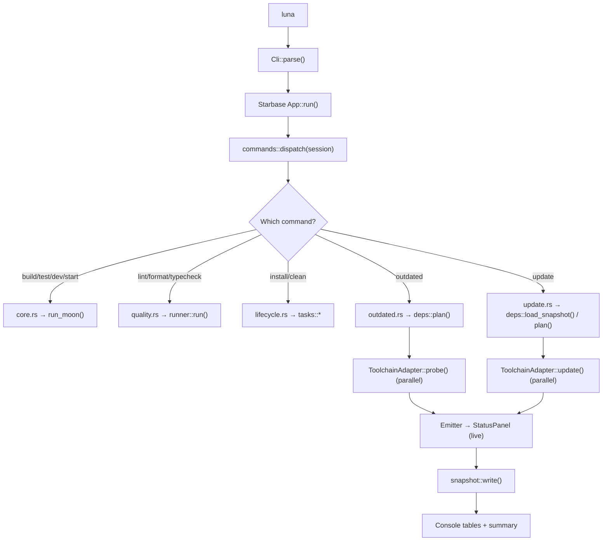
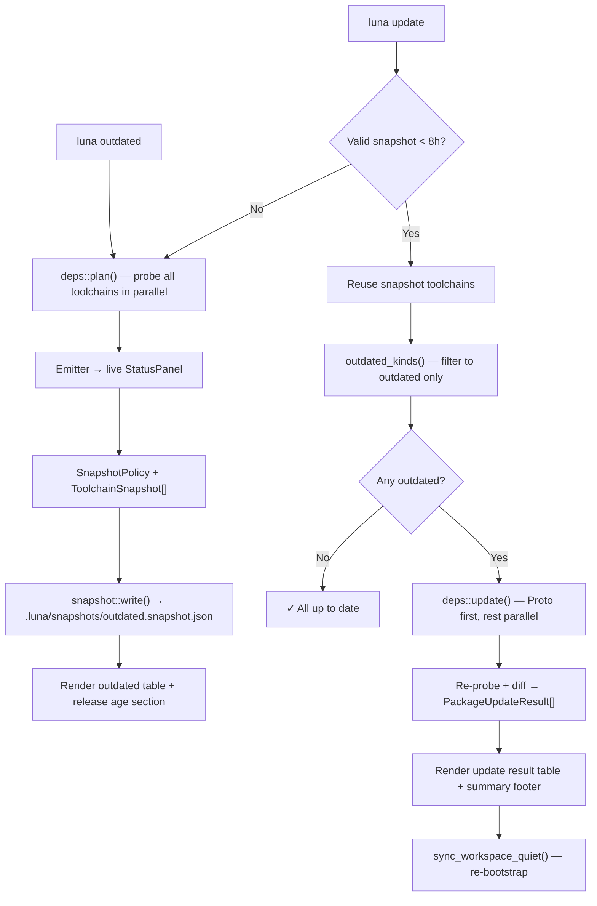
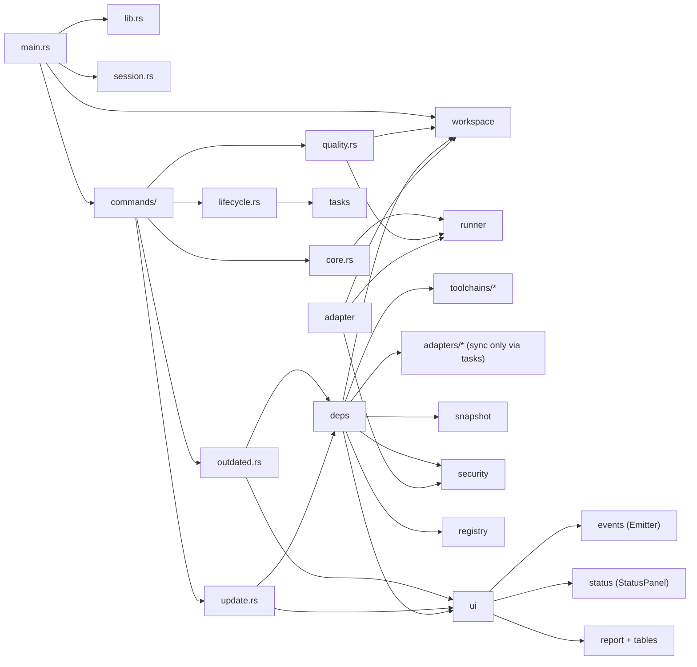

# `cli`

Rust CLI orchestrator for Luna, backed by [Moon](https://moonrepo.dev) and [Proto](https://moonrepo.dev/docs/proto).

## Purpose

Single-entry CLI for all monorepo operations — build, dev, test, lint, format, dependency management. Delegates to Moon for task execution and caching, and to Proto for toolchain pinning.

## Stack

- 🦀 [Rust](https://www.rust-lang.org/) — CLI runtime
- 🌙 [Moon](https://moonrepo.dev) — task orchestration, caching, project management
- 📦 [Proto](https://moonrepo.dev/docs/proto) — toolchain version pinning (`.prototools`)
- 📦 [Starbase](https://github.com/moonrepo/starbase) — CLI framework (async runtime, diagnostics, logging)

See root [README Tech Stacks](../../README.md#tech-stacks) for toolchain details.

## Commands

| Command                 | Description                                                                                                        |
| ----------------------- | ------------------------------------------------------------------------------------------------------------------ |
| `luna build`            | Run application-layer build tasks (`moon run :build`)                                                              |
| `luna build <project>`  | Build a specific project (`moon run <project>:build`)                                                              |
| `luna build --affected` | Build affected projects only                                                                                       |
| `luna dev`              | Start dev servers (`moon run :dev`)                                                                                |
| `luna start`            | Start production servers (`moon run :start`)                                                                       |
| `luna test`             | Run tests (`moon run :test`)                                                                                       |
| `luna run <targets...>` | Run Moon targets directly                                                                                          |
| `luna graph`            | Display project graph (`moon project-graph`)                                                                       |
| `luna tasks`            | List all Moon tasks                                                                                                |
| `luna projects`         | List all Moon projects                                                                                             |
| `luna ci`               | Run affected tasks in CI (`moon ci`)                                                                               |
| `luna install`          | Bootstrap workspace (proto + CLI + bun + uv sync + sync Go pins from `.prototools` + go work sync + web setup)     |
| `luna clean`            | Apps/packages → `moon clean --all` → root outputs (full reset for re-bootstrap)                                    |
| `luna lint`             | Lint all stacks (oxlint, ruff, cargo clippy)                                                                       |
| `luna lint --fix`       | Apply lint fixes                                                                                                   |
| `luna format`           | Format all stacks (oxfmt, ruff, cargo fmt)                                                                         |
| `luna format --check`   | Check formatting without writing                                                                                   |
| `luna typecheck`        | Typecheck all stacks (tsc, hugo)                                                                                   |
| `luna check`            | Lint + format:check + typecheck                                                                                    |
| `luna fix`              | Lint:fix + format                                                                                                  |
| `luna outdated`         | Probe proto/rust/bun/uv/go in parallel, flat outdated table + release-age notes, cache snapshot (exits 0)          |
| `luna update`           | Snapshot-first: reuse a `< 8h` snapshot (else preflight), update outdated toolchains, result table, then bootstrap |
| `luna update --major`   | Also apply major-version bumps where supported                                                                     |

## Dependency management

`luna outdated` and `luna update` share a planner ([`systems::deps`](src/systems/deps.rs)) that probes every
eligible toolchain in parallel behind a Luna-owned status panel, normalizes results into a
common row model ([`DependencyRow`](src/systems/model.rs)), and renders terminal reports via [`ui/report.rs`](src/ui/report.rs).

### `luna outdated`

- Runs parallel probes for **proto**, **rust**, **bun**, **uv**, and **go** (when present).
- Renders one **flat table**: Toolchain | Workspace | Dependency | Current | Newest | Latest | Release Age.
- Includes a **Release Age** footer explaining the 14-day supply-chain cooldown and bypass tips.
- Always exits **0** (informational). Diagnostics for failed probes live in the snapshot JSON (`--json`).

### `luna update`

- **Snapshot-first** — reuses `.luna/snapshots/outdated.snapshot.json` when `< 8h` old and policy/manifest fingerprints match; otherwise preflights like `luna outdated`.
- Updates **only outdated toolchains** (proto runs first, then the rest in parallel).
- After updates, **re-probes** each updated toolchain and diffs against the snapshot for accurate per-package status.
- Renders a **unified result table**: Toolchain | Workspace | Dependency | Previous | New | Status (`✓ updated`, `⊘ blocked`, `✗ failed`, `— unchanged`).
- Prints a one-line summary (`Updated N · Blocked N · …`), then **re-syncs the workspace** (pixi, bun, uv, go work sync, web setup).
- Does **not** repeat the outdated table or release-age section.

### Policy and release age

- **Snapshot** — `luna outdated` always overwrites [`.luna/snapshots/outdated.snapshot.json`](../../.luna/snapshots/outdated.snapshot.json) (atomic write).
- **Selective updates** — toolchains with no outdated rows show as skipped in the status panel (`—`).
- **Release Age** — publish ages are looked up from **npm** (Bun), **PyPI** (uv), and the **Go module proxy** (Go direct/tool deps). Newest is green when `≥ LUNA_MIN_RELEASE_AGE` days old (default 14); red when younger. Latest is yellow when exactly one major ahead of Current. Set `LUNA_MIN_RELEASE_AGE=0` to disable the cooldown for one invocation.

### Per-ecosystem probe behavior

| Ecosystem | Probe                                                                                          | Update                                                         |
| --------- | ---------------------------------------------------------------------------------------------- | -------------------------------------------------------------- |
| **Proto** | `proto outdated --json`                                                                        | `proto outdated --update`                                      |
| **Rust**  | `cargo outdated --format json`                                                                 | `cargo update`                                                 |
| **Bun**   | `bun outdated --recursive` + age-blocked stderr merge                                          | `bun update --recursive`                                       |
| **uv**    | `uv lock --upgrade --dry-run` per project                                                      | `uv lock --upgrade` + `uv sync`                                |
| **Go**    | `go list -m -u` on **tool directives ∪ direct requires** (skips indirect/transitive Hugo deps) | `go get -tool …@latest` + targeted `go get -u` + `go mod tidy` |

Go modules display short names (e.g. `gohugoio/hugo`) while `registry_name` holds the full module path for release-age lookups.

## Global flags

- `-v, --verbose` — increase logging verbosity (`--log debug` / `--log trace`)
- `-q, --quiet` — silence Luna and Moon output (`moon -q`)

## Local Development

**First-time install** (from repo root; requires proto + moon on PATH):

```sh
moon run luna:install
```

Or with `luna` already on PATH: `luna install`.

CLI only:

```sh
moon run cli:build      # target/debug/luna
moon run cli:install    # ~/.cargo/bin/luna
```

Build without installing:

```sh
./target/debug/luna --help
```

Run tests:

```sh
moon run cli:test
```

## Architecture

The CLI follows a Starbase-first modular layout:

```text
cli/src/
├── main.rs            # Binary entry: Starbase App lifecycle → commands::dispatch
├── lib.rs             # Crate root (re-exports Cli, LunaSession)
├── cli.rs             # Clap definitions (Commands enum, GlobalArgs, per-command arg structs)
├── session.rs         # Starbase AppSession wrapper (LunaSession)
├── commands/          # Command dispatch and implementations
│   ├── mod.rs         # dispatch() — async routing from parsed Commands → handler
│   ├── core.rs        # Moon task wrappers (build, test, dev, start, graph, tasks, projects, ci)
│   ├── lifecycle.rs   # Bootstrap/clean commands (install, install --workspace, clean)
│   ├── quality.rs     # Quality commands (lint, format, typecheck, check, fix)
│   ├── outdated.rs    # deps::plan() → outdated report + snapshot
│   └── update.rs      # Snapshot-first update → result table → workspace sync
├── adapters/          # BackendAdapter — sync, lock, planner steps, doctor, SBOM inventory
│   ├── mod.rs         # BackendAdapter trait, AdapterKind, registry::get()
│   ├── bun.rs         # bun install (release-age aware)
│   ├── go.rs          # go work sync, go toolchain pin sync
│   ├── uv.rs          # uv sync
│   ├── cargo.rs       # cargo fetch / lock
│   ├── proto.rs       # proto install
│   ├── pixi.rs        # pixi install
│   └── moon.rs        # moon run / ci backend
├── systems/           # Business logic and infrastructure
│   ├── mod.rs
│   ├── deps.rs        # Parallel outdated/update orchestration (JoinSet + spawn_blocking)
│   ├── tasks.rs       # Shared bootstrap/sync building blocks (install, clean, workspace sync)
│   ├── model.rs       # ToolchainKind, DependencyRow, PackageUpdateResult, ToolchainSnapshot
│   ├── snapshot.rs    # Schema, atomic read/write, validation, manifest fingerprints
│   ├── registry.rs    # npm / PyPI / Go proxy release-age lookups (cached, best-effort)
│   ├── runner.rs      # Process execution (run, capture, ensure_installed, run_moon, run_pm)
│   ├── security.rs    # Release-age policy, firewall resolution, Socket Firewall wrapping
│   └── workspace.rs   # Root discovery, project detection, go.mod parsing, go work sync
├── toolchains/        # ToolchainAdapter — outdated probe + selective update only
│   ├── mod.rs         # ToolchainAdapter trait, ProbeOutcome, UpdateOutcome, adapter_for()
│   ├── proto.rs       # proto outdated --json / proto outdated --update
│   ├── cargo.rs       # cargo outdated --format json / cargo update
│   ├── bun.rs         # bun outdated --recursive / bun update --recursive
│   ├── uv.rs          # uv lock --upgrade --dry-run / uv lock --upgrade
│   └── go.rs          # go list -m -u on tool+direct requires / targeted go get
└── ui/                # Console rendering and event bridge
    ├── mod.rs         # LunaConsole, new_console, notices, run_with_loader
    ├── events.rs      # Emitter — decouples systems from console rendering
    ├── status.rs      # Live/frozen StatusPanel (iocraft animated panel)
    ├── report.rs      # render_outdated_report / render_update_report entry points
    └── tables.rs      # Flat tables, release-age section, update result table + footer
```

### `adapters/` vs `toolchains/`

Both directories are are related but serve different layers:

| Layer                      | Module                           | Trait              | Used by                                            | Responsibility                                             |
| -------------------------- | -------------------------------- | ------------------ | -------------------------------------------------- | ---------------------------------------------------------- |
| **Bootstrap / planner**    | [`adapters/`](src/adapters/)     | `BackendAdapter`   | `luna install`, `luna sync`, planner, doctor, SBOM | Detect ecosystem, run `sync`/`lock`, execute planner steps |
| **Dependency maintenance** | [`toolchains/`](src/toolchains/) | `ToolchainAdapter` | `luna outdated`, `luna update`                     | Probe for outdated packages, apply selective upgrades      |

Example: [`adapters/go.rs`](src/adapters/go.rs) runs `go work sync` during bootstrap; [`toolchains/go.rs`](src/toolchains/go.rs) runs `go list -m -u` and `go get` during outdated/update. Same ecosystems, different contracts — do not merge or delete either layer.

### Command dispatch flow



### Outdated / Update lifecycle



### Module dependency graph



## Moon Tasks

| Task          | Purpose                                               |
| ------------- | ----------------------------------------------------- |
| `cli:build`   | Compile the CLI (`cargo build` → `target/debug/luna`) |
| `cli:install` | Install to `~/.cargo/bin` (`cargo install`)           |
| `cli:test`    | Run unit and integration tests                        |
| `cli:check`   | Run `cargo check` (via inherited task)                |
| `cli:clippy`  | Run `cargo clippy`                                    |
| `cli:fmt`     | Run `cargo fmt`                                       |

```sh
moon run cli:build
moon run cli:test
moon run cli:check
```

## Resources

### Framework and toolchain docs

- [Starbase](https://github.com/moonrepo/starbase) — Rust application framework (async runtime, diagnostics, logging)
- [starbase_console](https://docs.rs/starbase_console) — Terminal UI and console rendering
- [Clap](https://docs.rs/clap) — CLI argument parser (derive mode)
- [Moon](https://moonrepo.dev/docs) — Task orchestration, caching, project management
  - [Moon project config](https://moonrepo.dev/docs/config/project) — `moon.yml` task definitions
  - [Moon CI](https://moonrepo.dev/docs/guides/ci) — `moon ci` and affected-targets workflow
  - [Moon queries](https://moonrepo.dev/docs/guides/queries) — `moon query projects` for discovery
- [Proto](https://moonrepo.dev/docs/proto) — Multi-language toolchain version pinning (`.prototools`)

### Internal requirement docs

- [CLI Product Requirements (PRD)](../../docs/bin/luna-cli-PRD.md) — High-level feature spec for the refactor
- [CLI Technical Requirements (TRD)](../../docs/bin/luna-cli-TRD.md) — Technical specification (Starbase integration, service extraction)
- [CLI Architecture (ARD)](../../docs/bin/luna-cli-ARD.md) — Layer mapping and dependency overview
- [Rust/Starbase Research](../../docs/bin/luna-cli-rust-starbase-research.md) — Reference guidance on project structure and patterns

### Monorepo docs

- [Root README](../../README.md#tech-stacks) — Tech stacks and toolchain pins
- [Root README — Quick Start](../../README.md#quick-start) — Bootstrap flow
- [Root README — Commands](../../README.md#commands) — Quality checks, moon targets
- [Root README — Dependency Maintenance](../../README.md#dependency-maintenance) — `luna outdated` / `luna update` usage
